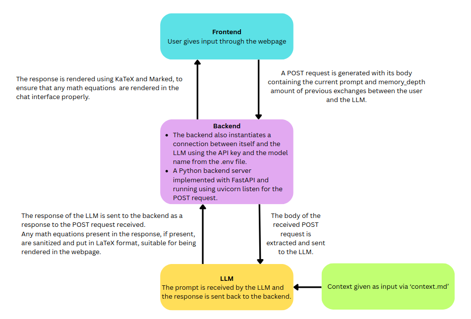
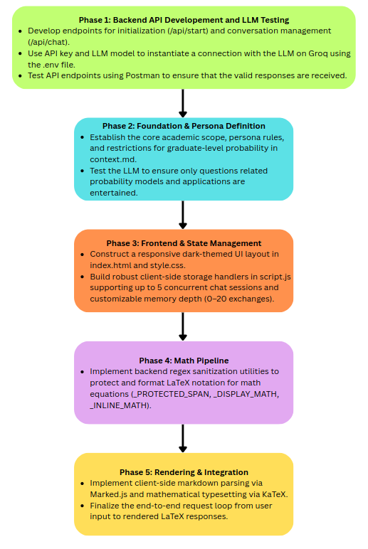

# Probability Models and Applications — AI Teaching Agent

## Overview

**Probability Models and Applications (PMA) — AI Teaching Agent** is a subject-specific conversational teaching assistant designed to support the study of probability and stochastic processes at postgraduate level.

The application combines a browser-based chat interface, a FastAPI backend, and the Groq Large Language Model API. The assistant’s teaching style and subject boundaries are defined in `context.md`, allowing the system to provide explanations, derivations, examples, and guided problem-solving rather than generic chatbot responses.

## Key Features

- Interactive browser-based chat interface
- Groq LLM integration through a FastAPI backend
- PMA-specific teaching persona and instructions
- Step-by-step mathematical explanations
- Markdown response rendering
- LaTeX mathematical notation rendered with KaTeX
- Multiple independent chat sessions
- Adjustable conversation-memory depth
- Browser-side persistence using `localStorage`
- Dedicated API endpoints for starting a session and sending messages

## System Architecture

The application follows a simple client–server architecture.

### Architecture Diagram



The frontend is responsible for the user interface, session management, message history, and rendering. The backend prepares the prompt using the teaching context and forwards the conversation to the selected Groq model.

## Project Structure

```text
Teaching-Agent/
├── main.py             # FastAPI application and Groq integration
├── index.html          # Main browser interface
├── script.js           # Frontend logic and API communication
├── style.css           # Frontend styling
├── context.md          # Teaching persona and PMA instructions
├── project_architecture.png  # System architecture diagram
├── project_plan.png    # Project development plan
├── .env                # Local configuration and API key
├── .env.example        # Example environment configuration
├── .gitignore          # Files excluded from version control
└── README.md           # Project documentation
```

## Project Plan

The project development plan is illustrated below.



The plan outlines the major stages of development, from defining the teaching requirements and designing the application architecture to implementing the backend, frontend, LLM integration, and testing.

## Technology Stack

| Component | Technology |
|---|---|
| Backend framework | FastAPI |
| ASGI server | Uvicorn |
| Language | Python |
| LLM provider | Groq API |
| Frontend | HTML, CSS, JavaScript |
| Mathematical rendering | KaTeX |
| Markdown rendering | Marked.js |
| Client-side storage | Browser `localStorage` |
| Configuration | `.env` via `python-dotenv` |

## Requirements

The project requires:

- Python 3.9 or newer
- `pip`
- A Groq API key
- A modern web browser
- Internet access for the Groq API and CDN-hosted frontend libraries

## Installation and Configuration

The application is organized as a lightweight local web application. Its Python dependencies are:

```text
fastapi
uvicorn
python-dotenv
groq
pydantic
```

The backend reads configuration from a `.env` file located beside `main.py`:

```text
GROQ_API_KEY=your_groq_api_key_here
LLM_MODEL=llama-3.3-70b-versatile
```

The real API key belongs only in `.env`.

## Teaching Context

The `context.md` file acts as the teaching specification for the agent. It defines the assistant’s:

- Subject area and topic boundaries
- Teaching persona
- Intended academic level
- Preferred explanation style
- Step-by-step problem-solving approach
- Use of intuitive explanations and examples
- Mathematical formatting conventions

This separation between application code and teaching instructions makes it possible to modify the assistant’s pedagogical behavior without changing the backend implementation.

## Backend API

The FastAPI service exposes the following endpoints.

### `POST /api/start`

Returns an initial welcome message for the teaching assistant.

### `POST /api/chat`

Accepts a conversation history and returns a generated teaching response.

Example request:

```json
{
  "messages": [
    {
      "role": "user",
      "content": "Explain almost-sure convergence."
    }
  ]
}
```

Example response:

```json
{
  "reply": "Generated teaching response..."
}
```

The supported message roles are `user` and `assistant`.

## Application Workflow

1. The user opens the browser interface.
2. The frontend displays the current chat session.
3. The user submits a PMA-related question.
4. The frontend sends the selected conversation history to `/api/chat`.
5. The backend combines the conversation with the instructions from `context.md`.
6. The backend requests a response from the configured Groq model.
7. The generated answer is returned to the frontend.
8. The frontend renders the response as Markdown with KaTeX mathematical notation.
9. The conversation is stored locally in the browser.

## Chat Sessions and Memory

The frontend supports multiple chat sessions. Each session maintains its own conversation history.

- **New Chat** creates a separate conversation.
- Chat tabs switch between existing sessions.
- Closing a session removes it from the frontend’s session list.
- The application supports up to five sessions.
- The memory setting controls how many previous exchanges are sent to the model.
- Chat sessions and memory preferences are stored in browser `localStorage`.
- The **Clear** action removes the stored messages from the current session.

This design allows the user to maintain separate discussions for different PMA topics while controlling how much earlier context is supplied to the model.

## Mathematical and Markdown Rendering

The assistant is designed to return mathematical content using LaTeX notation. The frontend uses:

- **Marked.js** for Markdown parsing
- **KaTeX** for mathematical rendering

This supports content such as equations, matrices, fractions, summations, probability expressions, and step-by-step derivations.

## Example Use Cases

The teaching agent can be used for questions such as:

- Explaining the difference between a random variable and a stochastic process
- Solving Markov-chain steady-state problems
- Explaining almost-sure, in-probability, and mean-square convergence
- Deriving probability distributions and expectation formulas
- Understanding conditional expectation and conditional probability
- Working through stochastic-process examples
- Reviewing definitions, theorems, and proof ideas
- Asking follow-up questions about a previous derivation

## Running the Application

The application consists of two locally running parts:

- The FastAPI backend, which communicates with Groq
- The browser frontend, which communicates with the backend

The backend normally runs at:

```text
http://127.0.0.1:8000
```

The frontend can be served through a local HTTP server, commonly at:

```text
http://127.0.0.1:5500
```

The frontend is configured to send API requests to the backend at `http://127.0.0.1:8000`.

To run the FastAPI backend, use the following command:

```text
uvicorn main:app --reload
```

## Limitations

- The quality of explanations depends on the selected Groq model.
- The agent may occasionally produce incorrect mathematical statements and should not replace textbook verification or instructor guidance.
- The frontend currently relies on CDN-hosted libraries.
- Conversation data is stored in browser `localStorage`, not in a central database.
- The application is primarily designed for local or demonstration use.
- Production deployment would require stronger CORS restrictions, secure secret management, authentication, and additional error handling.

## Future Improvements

Possible extensions include:

- Improved mathematical rendering and table formatting
- Streaming model responses
- Persistent server-side conversation storage
- User authentication
- File and lecture-note integration
- Topic-specific learning paths
- Automatic quizzes and practice problems
- Answer verification and theorem-checking workflows
- Better error reporting and model fallback handling
- Deployment as a hosted educational service

## Project Status

The project is a functional prototype of a subject-specific AI teaching agent. It demonstrates the integration of a web interface, FastAPI, Groq-based language generation, configurable teaching instructions, session management, and mathematical response rendering in a single educational application.
