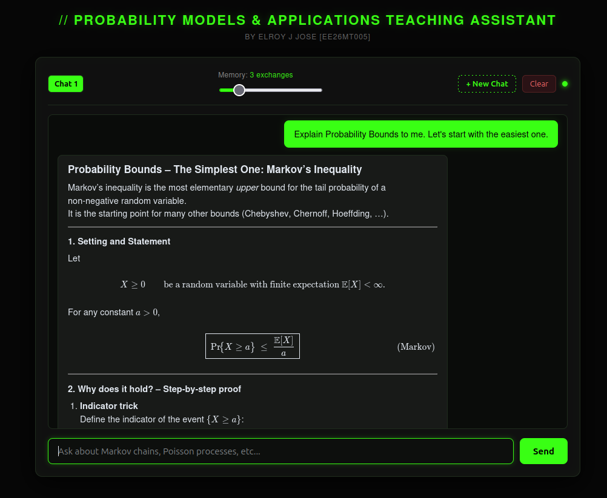

# Probability Models and Applications — AI Teaching Agent

## Overview

**Probability Models and Applications (PMA) — AI Teaching Agent** is a subject-specific conversational teaching assistant designed to support the study of probability and stochastic processes at postgraduate level.

The application combines a browser-based chat interface, a FastAPI backend, and the Groq Large Language Model API. The assistant’s teaching style and subject boundaries are defined in `context.md`, allowing the system to provide explanations, derivations, examples, and guided problem-solving rather than generic chatbot responses.

## Key Features

- Interactive browser-based chat interface
- Groq LLM integration through a FastAPI backend
- PMA-specific teaching persona and instructions
- Step-by-step mathematical explanations
- Markdown response rendering
- LaTeX mathematical notation rendered with KaTeX
- Multiple independent chat sessions
- Adjustable conversation-memory depth
- Browser-side persistence using `localStorage`
- Dedicated API endpoints for starting a session and sending messages

## System Architecture

The application follows a simple client–server architecture.

### Architecture Diagram


The frontend is responsible for the user interface, session management, message history, and rendering. The backend prepares the prompt using the teaching context and forwards the conversation to the selected Groq model.

## Project Structure

```text
Teaching-Agent/
├── main.py             # FastAPI application and Groq integration
├── index.html          # Main browser interface
├── script.js           # Frontend logic and API communication
├── style.css           # Frontend styling
├── context.md          # Teaching persona and PMA instructions
├── .env.example        # Example environment configuration
└── README.md           # Project documentation
```

## Project Plan

The project development plan is illustrated below.


The plan outlines the major stages of development, from defining the teaching requirements and designing the application architecture to implementing the backend, frontend, LLM integration, and testing.

## Requirements

The project requires:

- Python 3.9 or newer
- `pip`
- A Groq API key
- A modern web browser
- Internet access for the Groq API and CDN-hosted frontend libraries

## Installation and Configuration

The application is organized as a lightweight local web application. Its Python dependencies are:

```text
fastapi
uvicorn
python-dotenv
groq
pydantic
```

The backend reads configuration from a `.env` file located beside `main.py`:

```text
GROQ_API_KEY=your_groq_api_key_here
LLM_MODEL=llama-3.3-70b-versatile
```

The real API key belongs only in `.env`.

## Running the Application

The application consists of two locally running parts:

- The FastAPI backend, which communicates with Groq
- The browser frontend, which communicates with the backend

The backend normally runs at:

```text
http://127.0.0.1:8000
```

The frontend can be served through a local HTTP server, commonly at:

```text
http://127.0.0.1:5500
```

The frontend is configured to send API requests to the backend at `http://127.0.0.1:8000`.

To run the FastAPI backend, use the following command:

```text
uvicorn main:app --reload
```
Once the backend is up and running, open the index.html file using a browser of your choice.

## Working Web Application

The working web application is shown in the screenshot below.


